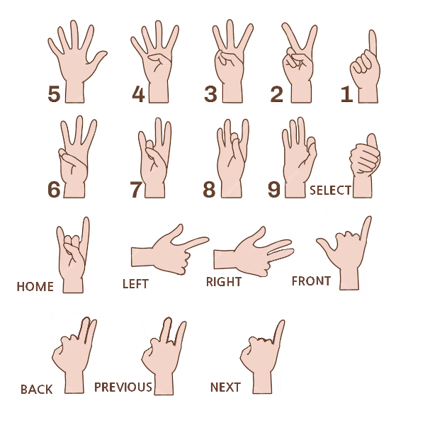

## 스마트 HACCP 솔루션 (음성 및 모션 인식 연동)

_`README` 는 **MARKDOWN** 형식으로 작성 되었습니다._ <hr>

### 목록 

**code**
- _`haccp.py`_
- _`dataset.py`_

**data**
- _`motion_dataset.csv`_
<br><br>

## `haccp.py`

코드는 다음과 같은 목적으로 작성되었습니다.

- _HACCP 솔루션과 음성 및 모션 인식 기술 연동_
- _WebSocket 통신을 통해 HACCP 솔루션 제어_

_사용자는 **음성 및 모션**으로 **HACCP 솔루션을 제어**할 수 있게 됩니다._

### 주요 기능 <hr>
- _**음성**을 통한 특정 명령 지시_
- _**모션 (손동작)** 을 통한 특정 명령 지시_
- _**HACCP 서버**와의 **WebSocket 통신**으로 명령 전달_
- _음성 및 모션 인식을 통한 스마트 **HACCP 솔루션 제어**_

### 음성 명령어 <hr>

```python
음성 인식 명령어

1. 홈 화면: "메인 화면"
2. 새로고침: "새로고침"
3. 뒤로: "페이지 뒤로"
4. 앞으로: "페이지 앞으로"
5. 품목명: "품목명"
6. 품목 선택 화면에서 왼쪽으로 넘김: "왼쪽으로 넘김"
7. 품목 선택 화면에서 오른쪽으로 넘김: "오른쪽으로 넘김"
8. 품목 선택 다중 보기에서 선택 시: "선택 #번"
9. 생산량 선택: "#kg"
10. 음성 인식 종료: "음성 인식 종료"
```

### 모션 제스쳐 <hr>
<br>
<div style="text-align: center;">
  
</div>
<br>


### 주요 플래그<hr>

- `motion_flag`

- `voice_flag`

<br>

_다음 플래그를 통해 음성 및 모션 인식 상태를 파악하고, 시작 및 종료 제어합니다._

### 음성 인식 함수 <hr>
```python
def run_voice():
    # 음성 인식 기능 실행
    # WebSocket 서버에 연결하고 음성 명령을 전송합니다.
    # 음성 명령을 인식하여 해당 명령을 처리합니다.
```

### 모션 인식 함수 <hr>
```python
def run_motion():
    # 모션 인식 기능 실행
    # WebSocket 서버에 연결하고 음성 명령을 전송합니다.
    # 모션 명령을 인식하여 해당 명령을 처리합니다.
```

### 키보드 입력 <hr>
```python
def on_press(event):
    # 키보드 입력 이벤트 처리
    # 'v' 키가 입력되면, 음성 인식을 시작합니다.
    # 'm' 키가 입력되면, 모션 인식을 시작합니다.
```

### 사용 방법 <hr>

**음성 인식**

    1. 시작: 'v' 키를 눌러 음성 인식을 시작합니다.
    2. 종료: 명령어 '음성 인식 종료'를 통해 종료합니다.

**모션 인식**

    1. 시작: 'm' 키를 눌러 모션 인식을 시작합니다.
    2. 종료: 'm' 키를 눌러 모션 인식을 종료합니다.

**전체 종료**

    'esc' 버튼을 눌러 음성 및 모션 인식을 종료합니다.


## `dataset.py`

코드는 다음과 같은 목적으로 작성되었습니다.

- _`MediaPipe`, `OpenCV` 를 사용하기 위한 **모션 데이터 셋** 구축_

### 사용 방법 <hr>


1. **CSV 파일 준비:**

    _`data` 폴더 안에 `motion_dataset.csv` 파일을 생성합니다._
<br><br>

2. **코드 실행:**

    ```bash
    python dataset.py
    ```
<br>

3. **데이터 수집:**

    - _코드가 실행되면 웹캠이 켜지고, 손동작 인식을 시작합니다._

    - _특정 제스처를 수행한 후, **왼쪽 마우스 버튼을 클릭**하여 데이터를 수집합니다._

    - _**'q'** 키를 눌러 프로그램을 종료하고, 수집된 데이터를 **CSV 파일**에 저장합니다._
<br><br>

## `motion_dataset.csv`

`dataset.py` 를 통해 구축한 **모션 데이터 셋**
<br><br>

## `HACCP 솔루션 관련 코드`

`IntelliJ` 를 통해 **구축한 HACCP 솔루션 서버 배포** 

1. _**음성 및 모션 인식 코드** 실행_ <br>

2. _**`IntelliJ`** 를 통해 구축한 **HACCP 솔루션 서버 배포**_ <br>

3. _**`WebSocket`** 으로 **서버**와 **음성 및 모션 인식 코드** 연결_ <br>

4. _**`JSON`** 형식으로 code, msg 전달_ <br>

5. _**서버** 에서 **`API`** 를 통해 전달받은 음성 및 모션 인식 **데이터 처리**_ <br>

6. _위 과정을 통해 **음성 및 모션 인식** 을 통한 **HACCP 솔루션** 조작 가능_

_(회사 측 자료가 포함되어 있어 `HACCP 솔루션 관련 코드` **공유 불가**)_